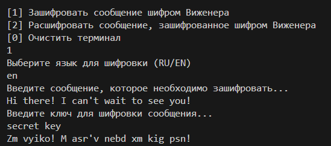
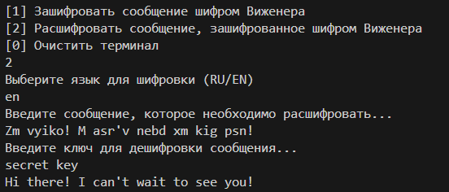

### CLI приложение для шифровки и расшифровки сообщения с помощью шифра Виженера. Доступен в двух языках: RU/EN.

--- 

#### Старт проекта:

``` bash
cd cmd/app
go run main.go
```

---

#### Функциональность

Данное приложение позволяет пользователю:

* Зашифровать сообщение с помощью ключа (RU/EN);
* Расшифровать сообщение с помощью ключа (RU/EN). 

---

#### Интерфейс программы




